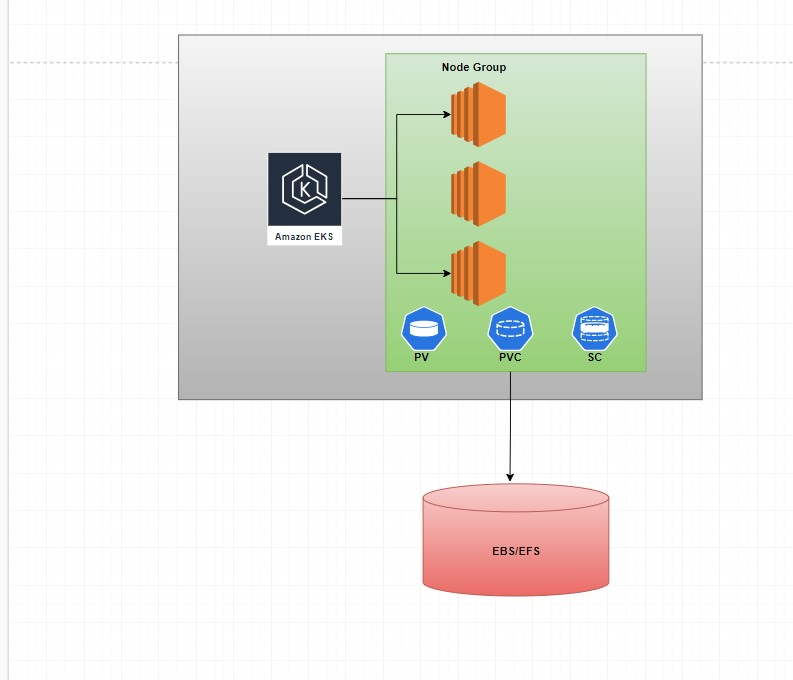
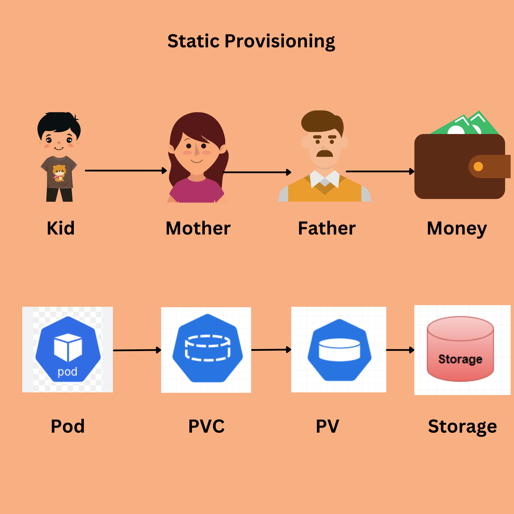
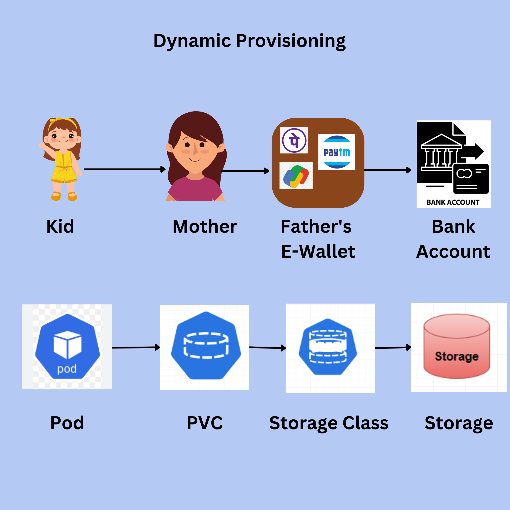

### Volumes in Kubernetes

We have 2 types of volumes in Kubernetes cluster.These volumes are internal to cluster.
* emptyDir
* hostPath

#### Empty Dir
This is the memory inside pod. It is useful when multiple containers inside Pod wants to share same storage. For example side cars can access application container log files and ship them to elastic search.

This will be deleted when pod gets deleted.

#### HostPath
This the memory location in the underlying host. Pods can get access to underlying server storage path through hostPath. This is useful in daemonSet. When we want to ship our host logs to elasticsearch we can use this.
**WARNING:** We should not use hostPath in application containers that can lead to security risks. Only use case is to ship host logs that should be in kube-system namespace.

emptyDir is used to ship container logs, hostPath is used to ship server logs.

### Storage in Kubernets
We have 2 types of storage options in Kubernetes.
1. Static provisioning
2. Dynamic provisioning

#### Storage Objects
1. Storage class
2. PV (Persistent Volume)
3. PVC (Persistent Volume Claim)



As a DevOps or Cloud Engineer we no need to learn the underlying storage concepts. Kubernetes made us the above objects available as wrapers.

**PV**

PV is a physical representation of underlying storage. PVC completely reflects the physical storage like memory, access options, reclaim policy, etc. PV is a cluster level resource.

**PVC**

PVC is a claim that comes from Pod. It's a resource that represents a user's demand for storage with specific properties, such as size, access mode (e.g., ReadWriteOnce, ReadOnlyMany), and a storage class. PVCs are used to consume storage from PVs.

**SC**

SC is used to dynamically create underlying storage, PV. SC uses the drivers to create external storage, it creates PV implicitly.

StorageClass may specify the provisioner as "kubernetes.io/aws-ebs" for dynamically provisioning EBS volumes on AWS. When a PVC requests storage from a StorageClass, Kubernetes will use the provisioner specified in the StorageClass to dynamically create and bind a PV that matches the PVC requirements.

**NOTE:** SC uses drivers to create storage.

Kubernetes foundation created CSI (Container Storage Interface). Earlier we were able to interact with EBS directly. But it is deprecated now, we should install CSI drivers.

EBS CSI
```
kubectl apply -k "github.com/kubernetes-sigs/aws-ebs-csi-driver/deploy/kubernetes/overlays/stable/?ref=release-1.21"
```
EFS CSI
```
kubectl kustomize \
    "github.com/kubernetes-sigs/aws-efs-csi-driver/deploy/kubernetes/overlays/stable/?ref=release-1.5" > public-ecr-driver.yaml
```
**Static Provisioning**
1. User should create storage manually. Make sure EC2 instance Role has EC2 Full access or not.
2. Create PV, storage class option should be empty. This is admin activity
3. Create PVC that can claim PV, storage class option should be empty
4. Use PVC in pod definition.

**Dynamic Provisioning**
1. We should have SC created for the storage type. This is admin activity.
2. Instances should have access to EBS/EFS. Check Security groups in case of EFS.
3. User should create PVC that can have storage class.
4. SC in background create PV implicitly.



